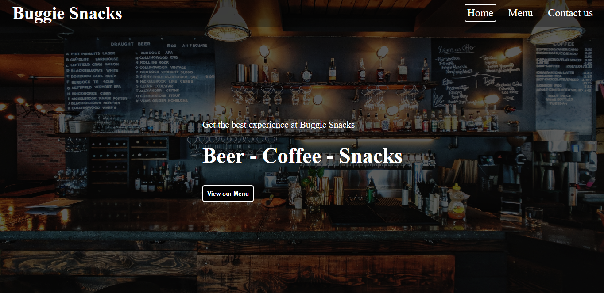

# Restaurant Page 

This is a single page restaurant website that was built to practice the use of Webpack together with loaders. The website elements are loaded dynamically by each of the created JS modules.

# Screenshot

## Potential Features
- Add form to submit reservation orders to an email/DB.
- View details for each menu item.

## Built With
- HTML & CSS
- JavaScript/ES6
- NPM + Webpack

## Live Demo
[Visit Live Demo](http://sebgil.me/restaurant_home/)

## Author

👤 **Sebastian Gil Rodriguez**

- Github: [@sebGilR](https://github.com/sebGilR)
- Twitter: [@sebGilR](https://twitter.com/sebGilR)
- Linkedin: [sebastiangilrodriguez](https://www.linkedin.com/in/sebastiangilrodriguez)

## 🤝 Contributing

Contributions, issues and feature requests are welcome!

Feel free to check the [issues page](https://github.com/sebGilR/restaurant_home/issues).

## Show your support

Give a ⭐️ if you like this project!
